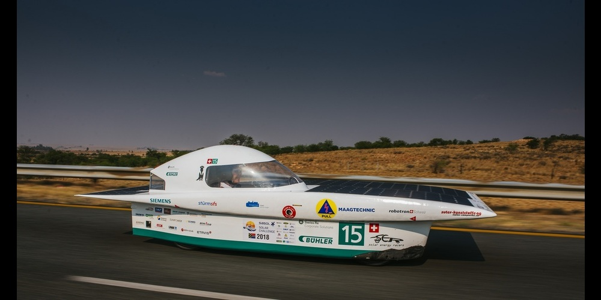

<h2 align="left">Hi 👋! My name is Felix</h2>

###
 - 🔭 Working as an intern at Maxon International in the field of digital transformation. Executing Process mining and machine learning projects. - 📚 Currently studying <a href="https://www.chalmers.se/en/education/find-masters-programme/complex-adaptive-systems-msc/">Complex Adaptive Systems</a> at Chalmers Technical University in Gothenburg
 - ⚡ Interested in Solar Racing <a href="https://www.facebook.com/solarenergyracers">Solar Energy Racers</a>, mechatronic systems, Machine Learning / AI

###

# Interesting Projects 🚀

<!-- Readme Cards -->

###

# Github Stats 📊

  <!--  -->
  

###

 

<h3 align="left">🛠 Language and tools</h3>

###

  
  
  
  
  
  
  
  
  
  
  
  
  
  
  
  
  
  
  
  
  
  
  
  
  

###

  

###

 

###
